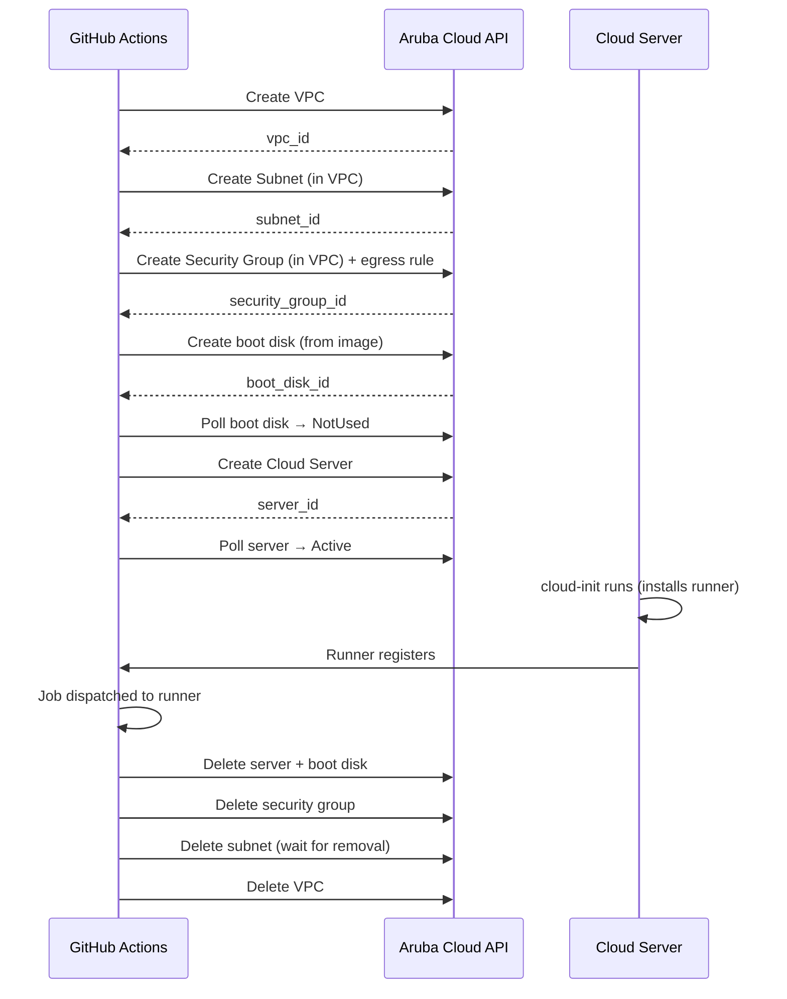

# Auto-Provisioned Networking

When `vpc_id`, `subnet_id`, and `security_group_id` are **omitted**, the action creates all required network resources automatically and cleans them up after the job. This is the simplest way to get started.

## What is auto-created

| Resource | Details |
|----------|---------|
| **VPC** | Named `<runner-name>-vpc` in the specified region |
| **Subnet** | Named `<runner-name>-subnet` with CIDR `10.0.0.0/24`, DHCP enabled |
| **Security group** | Named `<runner-name>-sg` with a single allow-all egress rule |

The auto-created IDs are emitted as outputs (`auto_vpc_id`, `auto_subnet_id`, `auto_security_group_id`) so the `stop-runner` step can delete them together with the server.

:::important
Always pass the `auto_*` outputs from the `start-runner` step to the `stop-runner` step, or the network resources will be orphaned and continue to exist after the job.
:::

## Full workflow example

```yaml
name: CI — auto-provisioned network

on:
  push:
    branches: [main]
  pull_request:

jobs:
  start-runner:
    name: Start ephemeral runner
    runs-on: ubuntu-latest
    timeout-minutes: 20
    outputs:
      label:                  ${{ steps.runner.outputs.label }}
      server_id:              ${{ steps.runner.outputs.server_id }}
      project_id:             ${{ steps.runner.outputs.project_id }}
      boot_disk_id:           ${{ steps.runner.outputs.boot_disk_id }}
      auto_vpc_id:            ${{ steps.runner.outputs.auto_vpc_id }}
      auto_subnet_id:         ${{ steps.runner.outputs.auto_subnet_id }}
      auto_security_group_id: ${{ steps.runner.outputs.auto_security_group_id }}
    steps:
      - uses: Arubacloud/acloud-github-runner@v1
        id: runner
        with:
          mode:                 create
          github_token:         ${{ secrets.GH_PAT }}
          acloud_client_id:     ${{ secrets.ACLOUD_CLIENT_ID }}
          acloud_client_secret: ${{ secrets.ACLOUD_CLIENT_SECRET }}
          acloud_project_id:    ${{ secrets.ACLOUD_PROJECT_ID }}
          # Network inputs omitted — created automatically.
          flavor:               CSO4A8   # 4 vCPU / 8 GB RAM
          image:                LU24-001 # Ubuntu 24.04 LTS
          boot_disk_size:       30       # GB

  build:
    name: Build & Test
    needs: start-runner
    runs-on: ${{ needs.start-runner.outputs.label }}
    timeout-minutes: 30
    steps:
      - uses: actions/checkout@v4
      - name: Install Go
        uses: actions/setup-go@v5
        with:
          go-version: '1.22'
      - run: go build ./...
      - run: go test ./...

  stop-runner:
    name: Stop ephemeral runner
    needs: [start-runner, build]
    runs-on: ubuntu-latest
    timeout-minutes: 15
    if: always()   # run even when build fails
    steps:
      - uses: Arubacloud/acloud-github-runner@v1
        with:
          mode:                   delete
          github_token:           ${{ secrets.GH_PAT }}
          acloud_client_id:       ${{ secrets.ACLOUD_CLIENT_ID }}
          acloud_client_secret:   ${{ secrets.ACLOUD_CLIENT_SECRET }}
          acloud_project_id:      ${{ needs.start-runner.outputs.project_id }}
          server_id:              ${{ needs.start-runner.outputs.server_id }}
          boot_disk_id:           ${{ needs.start-runner.outputs.boot_disk_id }}
          name:                   ${{ needs.start-runner.outputs.label }}
          # Pass the auto-created resource IDs so they are deleted on stop.
          auto_vpc_id:            ${{ needs.start-runner.outputs.auto_vpc_id }}
          auto_subnet_id:         ${{ needs.start-runner.outputs.auto_subnet_id }}
          auto_security_group_id: ${{ needs.start-runner.outputs.auto_security_group_id }}
```

## Provisioning timeline



## Pre-boot script

Use `pre_runner_script` to install packages or configure the environment before the runner starts:

```yaml
- uses: Arubacloud/acloud-github-runner@v1
  with:
    mode:               create
    # ... required inputs ...
    pre_runner_script: |
      apt-get update -qq
      apt-get install -y -qq docker.io jq
      systemctl enable --now docker
      usermod -aG docker ubuntu
```

## Custom runner labels

Add labels to target the runner from specific jobs:

```yaml
- uses: Arubacloud/acloud-github-runner@v1
  with:
    mode:          create
    runner_labels: self-hosted,linux,acloud,gpu
    # ... other inputs ...
```

Then reference the label:

```yaml
runs-on: [self-hosted, linux, acloud, gpu]
```

## Matrix builds

You can provision multiple runners in parallel for a matrix build by running the `start-runner` job with a strategy matrix:

```yaml
jobs:
  start-runner:
    strategy:
      matrix:
        go: ['1.21', '1.22']
    # ... rest of start-runner job ...
    steps:
      - uses: Arubacloud/acloud-github-runner@v1
        id: runner
        with:
          name: "runner-${{ github.run_id }}-${{ matrix.go }}"
          # ...
```
