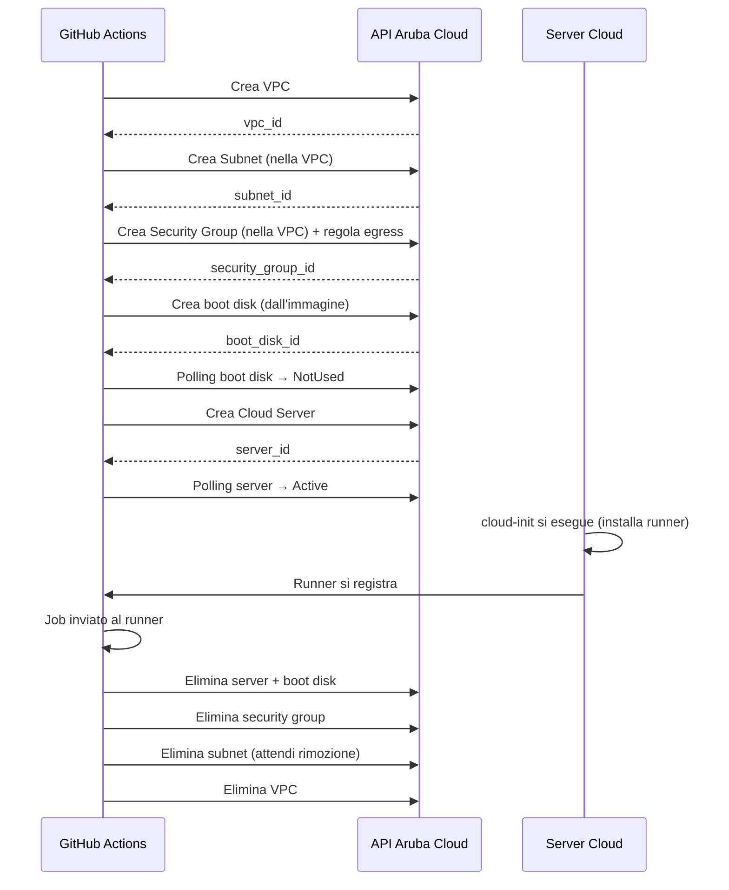

# Rete con Auto-Provisioning

Quando `vpc_id`, `subnet_id` e `security_group_id` vengono **omessi**, l'action crea automaticamente tutte le risorse di rete necessarie e le elimina al termine del job. Questo è il modo più semplice per iniziare.

## Cosa viene creato automaticamente

| Risorsa | Dettagli |
|---------|---------|
| **VPC** | Con nome `<nome-runner>-vpc` nella regione specificata |
| **Subnet** | Con nome `<nome-runner>-subnet`, CIDR `10.0.0.0/24`, DHCP abilitato |
| **Security group** | Con nome `<nome-runner>-sg` e una singola regola egress allow-all |

Gli ID creati automaticamente vengono emessi come output (`auto_vpc_id`, `auto_subnet_id`, `auto_security_group_id`) in modo che il passo `stop-runner` possa eliminarli insieme al server.

:::important
Passa sempre gli output `auto_*` dal passo `start-runner` al passo `stop-runner`, altrimenti le risorse di rete rimarranno orfane e continueranno ad esistere dopo il job.
:::

## Esempio di workflow completo

```yaml
name: CI — rete con auto-provisioning

on:
  push:
    branches: [main]
  pull_request:

jobs:
  start-runner:
    name: Avvia runner effimero
    runs-on: ubuntu-latest
    timeout-minutes: 20
    outputs:
      label:                  ${{ steps.runner.outputs.label }}
      server_id:              ${{ steps.runner.outputs.server_id }}
      project_id:             ${{ steps.runner.outputs.project_id }}
      boot_disk_id:           ${{ steps.runner.outputs.boot_disk_id }}
      auto_vpc_id:            ${{ steps.runner.outputs.auto_vpc_id }}
      auto_subnet_id:         ${{ steps.runner.outputs.auto_subnet_id }}
      auto_security_group_id: ${{ steps.runner.outputs.auto_security_group_id }}
    steps:
      - uses: Arubacloud/acloud-github-runner@v1
        id: runner
        with:
          mode:                 create
          github_token:         ${{ secrets.GH_PAT }}
          acloud_client_id:     ${{ secrets.ACLOUD_CLIENT_ID }}
          acloud_client_secret: ${{ secrets.ACLOUD_CLIENT_SECRET }}
          acloud_project_id:    ${{ secrets.ACLOUD_PROJECT_ID }}
          # Input di rete omessi — vengono creati automaticamente.
          flavor:               CSO4A8   # 4 vCPU / 8 GB RAM
          image:                LU24-001 # Ubuntu 24.04 LTS
          boot_disk_size:       30       # GB

  build:
    name: Build & Test
    needs: start-runner
    runs-on: ${{ needs.start-runner.outputs.label }}
    timeout-minutes: 30
    steps:
      - uses: actions/checkout@v7
      - name: Installa Go
        uses: actions/setup-go@v5
        with:
          go-version: '1.22'
      - run: go build ./...
      - run: go test ./...

  stop-runner:
    name: Ferma runner effimero
    needs: [start-runner, build]
    runs-on: ubuntu-latest
    timeout-minutes: 15
    if: always()   # esegui anche se la build fallisce
    steps:
      - uses: Arubacloud/acloud-github-runner@v1
        with:
          mode:                   delete
          github_token:           ${{ secrets.GH_PAT }}
          acloud_client_id:       ${{ secrets.ACLOUD_CLIENT_ID }}
          acloud_client_secret:   ${{ secrets.ACLOUD_CLIENT_SECRET }}
          acloud_project_id:      ${{ needs.start-runner.outputs.project_id }}
          server_id:              ${{ needs.start-runner.outputs.server_id }}
          boot_disk_id:           ${{ needs.start-runner.outputs.boot_disk_id }}
          name:                   ${{ needs.start-runner.outputs.label }}
          # Passa gli ID delle risorse auto-create per eliminarle.
          auto_vpc_id:            ${{ needs.start-runner.outputs.auto_vpc_id }}
          auto_subnet_id:         ${{ needs.start-runner.outputs.auto_subnet_id }}
          auto_security_group_id: ${{ needs.start-runner.outputs.auto_security_group_id }}
```

## Sequenza temporale del provisioning



## Script pre-avvio

Usa `pre_runner_script` per installare pacchetti o configurare l'ambiente prima dell'avvio del runner:

```yaml
- uses: Arubacloud/acloud-github-runner@v1
  with:
    mode:               create
    # ... input obbligatori ...
    pre_runner_script: |
      apt-get update -qq
      apt-get install -y -qq docker.io jq
      systemctl enable --now docker
      usermod -aG docker ubuntu
```

## Label del runner personalizzate

Aggiungi label per indirizzare job specifici al runner:

```yaml
- uses: Arubacloud/acloud-github-runner@v1
  with:
    mode:          create
    runner_labels: self-hosted,linux,acloud,gpu
    # ... altri input ...
```

Poi referenzia la label nel job:

```yaml
runs-on: [self-hosted, linux, acloud, gpu]
```

## Build a matrice

Puoi provisionare più runner in parallelo per una build a matrice eseguendo il job `start-runner` con una strategy matrix:

```yaml
jobs:
  start-runner:
    strategy:
      matrix:
        go: ['1.21', '1.22']
    # ... resto del job start-runner ...
    steps:
      - uses: Arubacloud/acloud-github-runner@v1
        id: runner
        with:
          name: "runner-${{ github.run_id }}-${{ matrix.go }}"
          # ...
```
